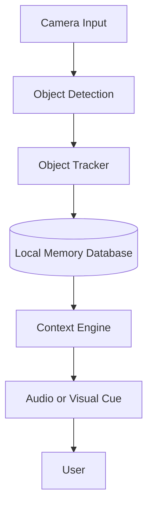

<div align="center">

# 🧠 MemoryCue

### Privacy-first edge AI glasses for dementia memory support

**MemoryCue** is an experimental edge AI prototype designed to help people living with dementia remember everyday objects, tasks, and context through gentle real-time cues.

<br />


<br />


</div>

---

## ⚠️ Disclaimer

> **MemoryCue is an early-stage student/research prototype.**
>
> It is **not** a medical device, diagnostic tool, clinical product, or replacement for caregivers.  
> The purpose of this project is to explore how privacy-preserving edge AI could support memory cueing and everyday independence for people living with dementia.

---

## ✨ Project Vision

People living with dementia may forget where important objects are, what they were doing, or what step comes next in a familiar routine.

MemoryCue explores a simple but powerful idea:

<div align="center">

### “What if your glasses could gently remind you what you were doing?”

</div>

Instead of relying on cloud-based monitoring, MemoryCue aims to process visual information locally on an edge AI device such as smart glasses, a Raspberry Pi, or an NVIDIA Jetson.

The goal is to create a private, offline, assistive memory system that can provide gentle prompts such as:

- “Your keys were last seen on the table.”
- “You were making tea.”
- “Your medication box is in front of you.”
- “You may be leaving without your wallet.”
- “You are in the kitchen.”

---

## 🧩 Problem

Dementia can affect memory, orientation, confidence, and independence in everyday life.

Common challenges may include:

- Misplacing important objects
- Forgetting why someone entered a room
- Leaving home without essential items
- Becoming confused during daily routines
- Forgetting whether a task has already been completed
- Needing frequent reassurance or caregiver support

Many assistive technologies depend on mobile apps, cloud services, or caregiver monitoring. MemoryCue explores a more private and immediate approach using **edge AI**.

---

## 💡 Core Idea

MemoryCue is not just an object detector.

It is designed around **task memory** and **context-aware cueing**.

The system aims to answer questions like:

| Question | Example Response |
|---|---|
| Where are my keys? | “Your keys were last seen on the desk.” |
| What was I doing? | “You were making tea.” |
| Am I forgetting something? | “Your wallet is still on the table.” |
| Where am I? | “You are in the kitchen.” |
| Did I take my medicine? | “The medication box was last opened this morning.” |

---

## 🧠 Why Edge AI?

Healthcare and dementia-related technologies can involve sensitive personal data.

MemoryCue is designed with a **local-first** architecture:

- No continuous cloud upload
- No facial recognition
- No remote video streaming
- Lower latency
- Offline operation
- Better privacy for users and caregivers
- More control over stored data

<div align="center">

### Camera input → Local AI → Local memory → Gentle cue

</div>

---

## 🏗️ High-Level Architecture

```text
Camera Input
     ↓
Object / Scene Detection
     ↓
Local Memory Store
     ↓
Context + Rule Engine
     ↓
Audio / Visual Cue
     ↓
User Support
```

---

## 🔍 Planned Features

### MVP Features

- [ ] Real-time camera input
- [ ] Local object detection
- [ ] Detection of 5–8 important everyday objects
- [ ] Last-seen memory for objects
- [ ] Local timestamped storage
- [ ] Simple query mode
- [ ] Audio cue using text-to-speech
- [ ] Basic dashboard or terminal interface

### Stretch Features

- [ ] Smart glasses or wearable camera form factor
- [ ] Voice query support
- [ ] Scene recognition
- [ ] Doorway reminder mode
- [ ] Medication reminder prototype
- [ ] Caregiver configuration panel
- [ ] On-device snapshot review
- [ ] Multi-language prompts

---

## 🎯 MVP Use Case

The first version of MemoryCue will focus on one clear demo:

<div align="center">

## “Where did I put it?”

</div>

The system will detect and remember where important objects were last seen.

Example objects:

- Keys
- Wallet
- Phone
- Glasses
- Medication box
- Mug
- ID card
- Notebook

---

## 🎬 Demo Scenario

1. A camera watches a desk or table.
2. The user places keys, wallet, phone, and medication box on the table.
3. MemoryCue detects the objects and stores their last known positions locally.
4. The user moves or removes one object.
5. The user asks:  
   **“Where are my keys?”**
6. MemoryCue responds:  
   **“Your keys were last seen on the left side of the table.”**
7. The system displays or stores the last known snapshot with the object highlighted.

---

## 🧪 Example Memory Record

```json
{
  "object": "keys",
  "last_seen_time": "14:32",
  "location_hint": "left side of desk",
  "confidence": 0.91,
  "snapshot_path": "local_snapshots/keys_1432.jpg"
}
```

---

## 🛠️ Possible Hardware

MemoryCue may be built using:

| Component | Purpose |
|---|---|
| Raspberry Pi 5 | Main edge computing device |
| Raspberry Pi AI HAT+ | Hardware acceleration |
| NVIDIA Jetson Nano / Orin Nano | Alternative edge AI platform |
| Google Coral USB Accelerator | Efficient model inference |
| Pi Camera / USB Camera | Visual input |
| Small speaker / earphone | Audio prompts |
| Push button | Manual query trigger |
| OLED / small display | Optional visual feedback |

---

## 🧰 Possible Software Stack

| Tool | Purpose |
|---|---|
| Python | Main programming language |
| OpenCV | Camera input and image processing |
| TensorFlow Lite / PyTorch | Edge AI inference |
| YOLO / MobileNet | Object detection |
| SQLite / JSON | Local object memory |
| pyttsx3 / eSpeak | Text-to-speech |
| Flask / Streamlit | Optional demo dashboard |

---

## 🧬 System Flow



---

## 🧠 Example Interaction

```text
User presses help button.

MemoryCue:
"What do you need help finding?"

User:
"Keys."

MemoryCue:
"Your keys were last seen 2 minutes ago on the left side of the desk."
```

---

## 🔐 Privacy Principles

MemoryCue is designed around privacy and dignity.

Planned safeguards:

- No facial recognition
- No cloud video upload
- No continuous remote monitoring
- Local-only processing where possible
- Minimal image storage
- Clear camera-on indicator
- Manual delete option for stored snapshots
- Gentle, non-alarming reminders
- Caregiver-configurable settings

---

## ❤️ Ethical Design Goals

Because this project relates to dementia care, ethical design is a core part of the system.

MemoryCue should:

- Support independence
- Reduce anxiety
- Avoid shame or blame
- Use calm and respectful language
- Keep users in control where possible
- Avoid unnecessary surveillance
- Be transparent about limitations
- Assist caregivers without replacing them

MemoryCue should **not** make users feel watched, judged, or controlled.

---

## 🚫 What MemoryCue Is Not

MemoryCue is not:

- A medical device
- A diagnostic tool
- A dementia treatment
- A replacement for caregivers
- A surveillance system
- A face recognition system
- A cloud monitoring platform

---

## 📅 One-Week Development Plan

### Day 1 — Setup

- Set up edge device
- Connect camera
- Capture live video stream
- Run first object detection test

### Day 2 — Object Detection

- Choose target objects
- Test detection model
- Collect sample images if needed
- Add bounding box display

### Day 3 — Local Memory

- Store detected objects
- Save timestamps
- Track last-seen locations
- Create local JSON or SQLite database

### Day 4 — Query System

- Add simple text or button query
- Retrieve object history
- Display last-seen result
- Add snapshot preview

### Day 5 — Audio Cues

- Add text-to-speech
- Create gentle reminder phrases
- Test response timing
- Improve user flow

### Day 6 — Demo Mode

- Build table/desk demo
- Add simple dashboard
- Improve reliability
- Prepare sample scenarios

### Day 7 — Polish

- Record final demo video
- Improve README
- Add diagrams and screenshots
- Prepare presentation/demo script

---

## ✅ MVP Success Criteria

The first working prototype should be able to:

- Detect at least 5 everyday objects
- Store when and where each object was last seen
- Answer a basic “Where is my object?” query
- Run locally on an edge device
- Provide a simple visual or audio cue
- Demonstrate a dementia-support use case clearly

---

## 📊 Evaluation Metrics

| Metric | Target |
|---|---|
| Object detection accuracy | 80%+ for selected objects |
| Query response time | Under 2 seconds |
| Offline functionality | Fully offline demo |
| Stored data location | Local device only |
| Demo clarity | Understandable to non-technical audience |
| Reminder tone | Gentle and non-alarming |

---

## 🖼️ Screenshots

> Screenshots will be added as the prototype is developed.

```text
assets/
├── dashboard-preview.png
├── detection-demo.png
└── memorycue-banner.png
```

---

## 🚀 Future Improvements

Possible future versions may include:

- Wearable glasses form factor
- Personalized object learning
- Room-level scene recognition
- Medication routine support
- Caregiver dashboard
- Multi-language reminders
- Voice-based search
- Fall-risk context detection
- Safer doorway reminder mode
- Integration with non-camera sensors

---

## 📁 Planned Repository Structure

```text
memorycue/
├── README.md
├── assets/
│   └── memorycue-banner.png
├── data/
│   └── sample_objects/
├── models/
│   └── README.md
├── src/
│   ├── camera.py
│   ├── detect.py
│   ├── memory_store.py
│   ├── cue_engine.py
│   └── main.py
├── demo/
│   └── demo_script.md
├── requirements.txt
└── LICENSE
```

---

## 🧑‍💻 Development Status

<div align="center">

| Area | Status |
|---|---|
| Concept | ✅ Complete |
| README | ✅ In progress |
| Hardware setup | ⏳ Not started |
| Object detection | ⏳ Not started |
| Local memory | ⏳ Not started |
| Audio cues | ⏳ Not started |
| Final demo | ⏳ Not started |

</div>

---

## 🤝 Contributing

This project is currently in the early planning and prototyping stage.

Ideas, suggestions, ethical concerns, and accessibility feedback are welcome.

---

## 📜 License

License to be decided.

---

<div align="center">

### MemoryCue

**A private edge AI memory assistant for everyday dementia support.**

</div>
